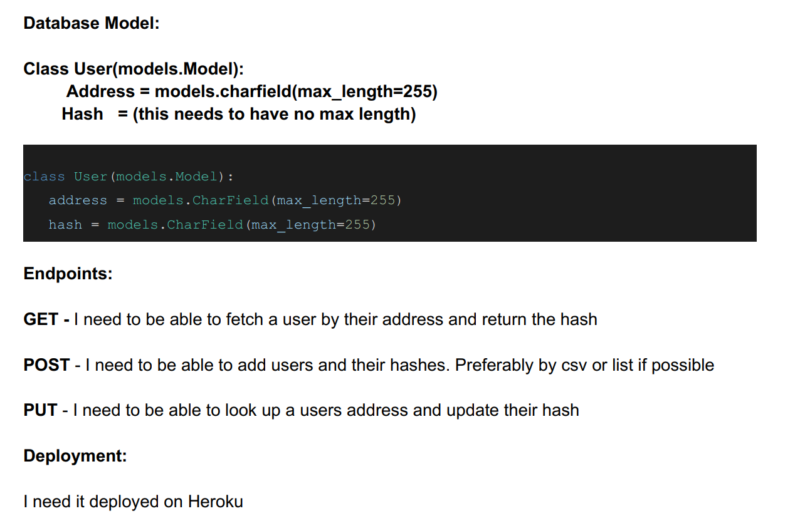

# Adress-Hashing-Django

### Requirements

###### Database Model:
    Class User(models.Model):
        Address = models.charfield(max_length=255)
        Hash = (this needs to have no max length)

##### Endpoints:
**GET** - I need to be able to fetch a user by their address and return the hash.\
**POST** - I need to be able to add users and their hashes Preferably by csv or list if possible.\
**PUT** - I need to be able to look up a users address and update their hash.\

##### Deployment:
Have to deployed it on Heroku. That’s it! No frontend needed.
